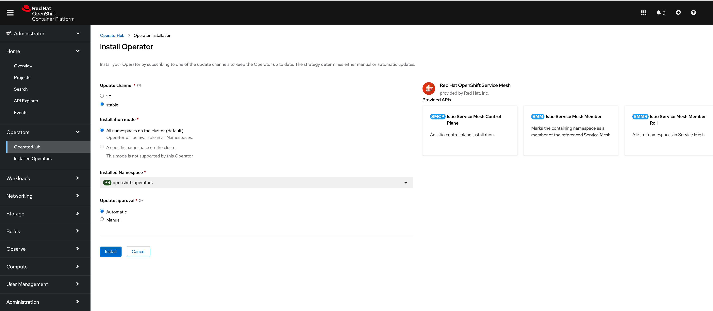

## Enviroment

> OpenShift version
> 4.9.15

### Instalation

1. OpenShift Elasticsearch Operator


2. Red Hat OpenShift distributed tracing platform


3. Kiali Operator
   
4. Red Hat OpenShift Service Mesh
   


### Configuration


## Secure Gateways

### Setup

#### Variables

```shell
NS=demo-sm
CTRL_PLANE_NS=istio-system
SECRET=httpbin-credential
SECURE_INGRESS_PORT=443
INGRESS_HOST=$(oc get pod -l app=vsphere-infra-vrrp -o yaml -n openshift-vsphere-infra | grep -i '\-\-ingress-vip' -A1 | grep -v '\-\-ingress-vip\|--' | uniq | awk '{print $2}')
```

#### Configurations

```shell
$ oc new-project $NS
$ oc adm policy add-scc-to-user anyuid -z httpbin
```


### Httbin Deploy

```shell
# vinculate to service mesh
$ oc apply -f smm.yml
servicemeshmember.maistra.io/default created

# check member
$ oc get smmr -n ${CTRL_PLANE_NS} -o yaml | grep -A2 'members:'
...
    members:
    - demo-sm
    meshGeneration: 1
# deploy
$ oc apply -f httpbin.yml
serviceaccount/httpbin created
service/httpbin created
deployment.apps/httpbin created

# check 2/2
$ oc get pod
NAME                      READY   STATUS    RESTARTS   AGE
httpbin-87d95b7c6-gf6zn   2/2     Running   0          25s
```

### Before you begin

1. [Determining the ingress IP and ports](https://istio.io/v1.9/docs/tasks/traffic-management/ingress/ingress-control/#determining-the-ingress-ip-and-ports) sections of the [Control Ingress Traffic](https://istio.io/v1.9/docs/tasks/traffic-management/ingress/ingress-control) task. After performing those steps you should have Istio and the [httpbin](https://github.com/istio/istio/tree/release-1.9/samples/httpbin) service deployed, and the environment variables `INGRESS_HOST` and `SECURE_INGRESS_PORT` set.

   ```shell
   $ oc get svc istio-ingressgateway -n ${CTRL_PLANE_NS}
   
   NAME                   TYPE        CLUSTER-IP      EXTERNAL-IP   PORT(S)                              AGE
   istio-ingressgateway   ClusterIP   172.30.19.220   <none>        15021/TCP,80/TCP,443/TCP,15443/TCP   12m
   ```

   

2. For <u>macOS</u> users, verify that you use `curl` compiled with the [LibreSSL](http://www.libressl.org/) library:

   ```shell
   $ curl --version | grep LibreSSL
   curl 7.77.0 (x86_64-apple-darwin21.0) libcurl/7.77.0 (SecureTransport) LibreSSL/2.8.3 zlib/1.2.11 nghttp2/1.42.0 
   ```


#### Generate client and server certificates and keys

```shell
# For this task you can use your favorite tool to generate certificates and keys. The commands below use openssl
# Create a root certificate and private key to sign the certificate for your services:

$ mkdir -p keys && cd $_
$ openssl req -x509 -sha256 -nodes -days 365 -newkey rsa:2048 -subj '/O=example Inc./CN=example.com' -keyout example.com.key -out example.com.crt

# Create a certificate and a private key for httpbin.example.com:
openssl req -out httpbin.example.com.csr -newkey rsa:2048 -nodes -keyout httpbin.example.com.key -subj "/CN=httpbin.example.com/O=httpbin organization"
openssl x509 -req -sha256 -days 365 -CA example.com.crt -CAkey example.com.key -set_serial 0 -in httpbin.example.com.csr -out httpbin.example.com.crt

cd ..
```


## Cases to place TLS credential

### Application namespace tells gateway deployment to use credential in its own namespace

> *this is default way...*

Create a secret for the ingress gateway:

```shell
$ oc create -n ${CTRL_PLANE_NS} secret tls ${SECRET} --key=keys/httpbin.example.com.key --cert=keys/httpbin.example.com.crt
secret/httpbin-credential created
```

Define a gateway with a `servers:` section for port 443, and specify values for `credentialName` to be `httpbin-credential`. The values are the same as the secret’s name. The TLS mode should have the value of `SIMPLE`.

```yaml
$ cat <<EOF | oc apply -f -
apiVersion: networking.istio.io/v1beta1
kind: Gateway
metadata:
  name: mygateway
spec:
  selector:
    istio: ingressgateway # use istio default ingress gateway
  servers:
  - port:
      number: 80
      name: http
      protocol: HTTP
    hosts:
    - httpbin.example.com
    tls:
      httpsRedirect: true
  - port:
      number: ${SECURE_INGRESS_PORT}
      name: https
      protocol: HTTPS
    tls:
      mode: SIMPLE
      credentialName: ${SECRET} # must be the same as secret
    hosts:
    - httpbin.example.com
EOF
gateway.networking.istio.io/mygateway created
```

Configure the gateway’s ingress traffic routes. Define the corresponding virtual service.

```yaml
$ cat <<EOF | oc apply -f -
apiVersion: networking.istio.io/v1beta1
kind: VirtualService
metadata:
  name: httpbin
spec:
  hosts:
  - "httpbin.example.com"
  gateways:
  - mygateway
  http:
  - match:
    - uri:
        prefix: /status
    - uri:
        prefix: /delay
    route:
    - destination:
        port:
          number: 8000
        host: httpbin
EOF
virtualservice.networking.istio.io/httpbin created
```

Send an HTTPS request to access the `httpbin` service through HTTPS:

```shell
$ H=httpbin.example.com
#curl -v --resolve "$H:$SECURE_INGRESS_PORT:$INGRESS_HOST" --cacert keys/example.com.crt "https://$H:$SECURE_INGRESS_PORT/status/418"

$ curl -H "Host: $H" --cacert keys/example.com.crt --resolve "$H:443:$INGRESS_HOST" "https://$H:$SECURE_INGRESS_PORT/status/418"
    -=[ teapot ]=-

       _...._
     .'  _ _ `.
    | ."` ^ `". _,
    \_;`"---"`|//
      |       ;/
      \_     _/
        `"""`
```


## Cleanup

```shell
# delete istio-system previous secret
$ oc delete -n ${CTRL_PLANE_NS} secret/${SECRET}
secret "httpbin-credential" deleted

$ oc delete vs httpbin
virtualservice.networking.istio.io "httpbin" deleted

$ oc delete gw mygateway
gateway.networking.istio.io "mygateway" deleted

# scale down
$ oc scale deploy --all --replicas=0
deployment.apps/httpbin scaled
```


### Application namespace tells gateway deployment to use credential in application namespace

> As namespace owner, they have permission to delegate the credential.

Create a secret for the ingress gateway:

```shell
$ oc create secret tls ${SECRET} --key=keys/httpbin.example.com.key --cert=keys/httpbin.example.com.crt
secret/httpbin-credential created
```

Define a gateway with a `servers:` section for port 443, and specify values for `credentialName` to be `httpbin-credential`. The values are the same as the secret’s name. The TLS mode should have the value of `SIMPLE`.

```yaml
$ cat <<EOF | oc apply -f -
apiVersion: networking.istio.io/v1beta1
kind: Gateway
metadata:
  name: mygateway
spec:
  selector:
    istio: ingressgateway # use istio default ingress gateway
  servers:
  - port:
      number: 80
      name: http
      protocol: HTTP
    hosts:
    - httpbin.example.com
    tls:
      httpsRedirect: true
  - port:
      number: ${SECURE_INGRESS_PORT}
      name: https
      protocol: HTTPS
    tls:
      mode: SIMPLE
      credentialName: ${NS}/${SECRET} # must be the same as secret
    hosts:
    - httpbin.example.com
EOF
gateway.networking.istio.io/mygateway created
```

Configure the gateway’s ingress traffic routes. Define the corresponding virtual service.

```yaml
$ cat <<EOF | oc apply -f -
apiVersion: networking.istio.io/v1beta1
kind: VirtualService
metadata:
  name: httpbin
spec:
  hosts:
  - "httpbin.example.com"
  gateways:
  - mygateway
  http:
  - match:
    - uri:
        prefix: /status
    - uri:
        prefix: /delay
    route:
    - destination:
        port:
          number: 8000
        host: httpbin
EOF
virtualservice.networking.istio.io/httpbin created

# scale up
$ oc scale deploy --all --replicas=1
```

Send an HTTPS request to access the `httpbin` service through HTTPS:

```shell
$ H=httpbin.example.com
#curl -v --resolve "$H:$SECURE_INGRESS_PORT:$INGRESS_HOST" --cacert keys/example.com.crt "https://$H:$SECURE_INGRESS_PORT/status/418"

$ curl -v -I -H "Host: $H" --cacert keys/example.com.crt --resolve "$H:443:$INGRESS_HOST" "https://$H:$SECURE_INGRESS_PORT/status/418"
* Added httpbin.example.com:443:10.36.5.2 to DNS cache
* Hostname httpbin.example.com was found in DNS cache
*   Trying 10.36.5.2:443...
* Connected to httpbin.example.com (10.36.5.2) port 443 (#0)
* ALPN, offering h2
* ALPN, offering http/1.1
* successfully set certificate verify locations:
*  CAfile: keys/example.com.crt
*  CApath: none
* TLSv1.2 (OUT), TLS handshake, Client hello (1):
* LibreSSL SSL_connect: SSL_ERROR_SYSCALL in connection to httpbin.example.com:443
* Closing connection 0
curl: (35) LibreSSL SSL_connect: SSL_ERROR_SYSCALL in connection to httpbin.example.com:443
```


### Application namespace tells gateway deployment to use credential in another namespace

>  As namespace owner, they do not have permission to delegate the credential.
>
> However, the other namespace explicitly allows it via `exportTo`

```shell
# scale down
$ oc scale deploy --all --replicas=0
deployment.apps/httpbin scaled

$ oc annotate secret ${SECRET} istio.io/exportTo="*"
secret/httpbin-credential annotated

$ oc get secret ${SECRET} -o yaml | grep -B 1 'exportTo'
  annotations:
    istio.io/exportTo: '*'
...

# scale up
$ oc scale deploy --all --replicas=1
deployment.apps/httpbin scaled
```

Send an HTTPS request to access the `httpbin` service through HTTPS:

```shell
$ H=httpbin.example.com
#curl -v --resolve "$H:$SECURE_INGRESS_PORT:$INGRESS_HOST" --cacert keys/example.com.crt "https://$H:$SECURE_INGRESS_PORT/status/418"

$ curl -v -I -H "Host: $H" --cacert keys/example.com.crt --resolve "$H:443:$INGRESS_HOST" "https://$H:$SECURE_INGRESS_PORT/status/418"
* Added httpbin.example.com:443:10.36.5.2 to DNS cache
* Hostname httpbin.example.com was found in DNS cache
*   Trying 10.36.5.2:443...
* Connected to httpbin.example.com (10.36.5.2) port 443 (#0)
* ALPN, offering h2
* ALPN, offering http/1.1
* successfully set certificate verify locations:
*  CAfile: keys/example.com.crt
*  CApath: none
* TLSv1.2 (OUT), TLS handshake, Client hello (1):
* LibreSSL SSL_connect: SSL_ERROR_SYSCALL in connection to httpbin.example.com:443
* Closing connection 0
curl: (35) LibreSSL SSL_connect: SSL_ERROR_SYSCALL in connection to httpbin.example.com:443
```


## Reference

* [Secure Gateways](https://istio.io/v1.9/docs/tasks/traffic-management/ingress/secure-ingress/)
* [Option 9](https://docs.google.com/document/d/1nwTh2g7FgdkC8suc3SHZ5le_4Rkm8YvLY8Cgah4cm-I/edit#bookmark=id.aced6rh4l23): Use Gateway/DestinationRule references